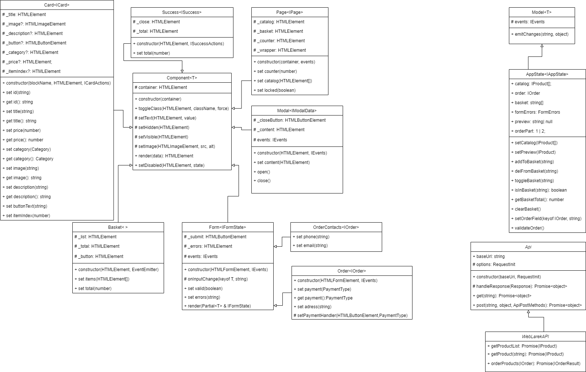

# Проектная работа "Веб-ларек"

Стек: HTML, SCSS, TS, Webpack

Структура проекта:
- src/ — исходные файлы проекта
- src/components/ — папка с JS компонентами
- src/components/base/ — папка с базовым кодом

Важные файлы:
- src/pages/index.html — HTML-файл главной страницы
- src/types/index.ts — файл с типами
- src/index.ts — точка входа приложения
- src/styles/styles.scss — корневой файл стилей
- src/utils/constants.ts — файл с константами
- src/utils/utils.ts — файл с утилитами

## Установка и запуск
Для установки и запуска проекта необходимо выполнить команды

```
npm install
npm run start
```

или

```
yarn
yarn start
```
## Сборка

```
npm run build
```

или

```
yarn build
```
## Архитектура


## Базовый код
### 1. Класс EventEmitter
Класс EventEmitter обеспечивает работу событий. Его функции: возможность установить и снять слушателей событий, вызвать слушателей при возникновении события.

Класс имеет такие методы:
- on, off, onAll, ofAll - установка и снятия обработчика с события
- emit - инициировать событие с данными
- trigger - получить коллбек триггер, генерирующий событие при вызове

Также класс реализует интерфейс IEvents универсального брокера событий.
```JavaScript
export interface IEvents {
    on<T extends object>(event: EventName, callback: (data: T) => void): void;
    emit<T extends object>(event: string, data?: T): void;
    trigger<T extends object>(event: string, context?: Partial<T>): (data: T) => void;
}
```

### 2. Класс Api
Класс EventEmitter обеспечивает работу с внешними API-сервисами. Его функции: отправить к сервису запрос и получить ответ.

Конструктор принимает такие аргументы:
- baseUrl: string - базовый WWW-адрес сервиса
- options: RequestInit - дополнительные опции заголовка запроса

Класс имеет такие методы:
- get, post - для отправки к сервису запросов


### 3. Класс WebLarekApi
Класс WebLarekApi обеспечивает работу с внешним API-сервисом "WebLarek". Его функции: получить список товаров, подробную информацию о товаре, сделать заказ.

Класс имеет такие методы:
- getProductList - для получения списка товаров
- getProduct - для получения подробной информации о товаре
- orderProducts - сделать заказ товара

Также класс является наследником класса Api и реализует интерфейс IWebLarekAPI.

## Компоненты модели данных (бизнес-логика)
### 1. Класс Model\<T\>
Базовая модель, чтобы можно было отличить ее от простых объектов с данными. Представляет собой абстрактный класс с типом-дженериком T. 
T - это тип обрабатываемых данных в модели. 

Конструктор принимает такие аргументы:
- data: Partial\<T\> - сами обрабатываемые данные
- events: IEvents - обработчики событий

Класс имеет метод:
- emitChanges - для генерации событий с передачей данных


### 2. Класс AppState
Содержит состояние всего приложения и управляет этим состоянием. 

Класс имеет такие методы:
- setCatalog - загрузить в модель содержимое всего каталога товара и вызвать соотв. событие
- setOrderField - установить указанное поле заказа
- validateOrder - проверить корректность заполнения заказа
- deleteFromBasket - удалить товар с корзины
- clearBasket - очистить всю корзину
- addToBasket - добавить товар в корзину
- clearOrder - очистить весь заказ
- getTotal - вернуть итоговую сумму заказа
- setPreview - установить текущий товар и вызвать соотв. событие

Также класс является наследником класса Model с дженерик типом равным IAppState.
```JavaScript
export interface IAppState {
    catalog: IProductList;
    basket: ItemID[];
    preview: ItemID | null;
    order: IOrder | null;
}
```

## Компоненты представления

### 1. Компонент Component\<T\>
Абстрактный базовый класс-родитель для всех View проекта. 
Его функции: создать в заданном корневом контейнере HTMLElement посредством предоставляемых функций.

Конструктор принимает такие аргументы:
- container: HTMLElement - контейнер, в котором будет формироваться HTMLElement

Класс имеет главный универсальный метод render. Который проставляет переданные даннеые в поля текщего компонента.

Класс имеет также общие методы:
- toggleClass - сменить класс у заданного HTMLElement
- setText - установить текстовое содержимое у заданного HTMLElement
- setDisabled - установить статус блокировки у заданного HTMLElement
- setHidden - сделать заданный HTMLElement невидимым
- setVisible - сделать заданный HTMLElement видимым
- setImage - задать указанному HTMLElement изображение

Класс использует дженерик типа T, который есть тот самый тип полей компонента. Который у каждого конечного компонента будет свой уникальный.

### 2. Компонент Success
Окно успешного заказа. Отображает итоговую сумму покупки и кнопку закрытия окна.

Конструктор принимает такие аргументы:
- container: HTMLElement - корневой контейнер
- actions: ISuccessActions - обработчик события 

Класс использует дженерик ISuccess=сумма итого.
```JavaScript
interface ISuccess {
    total: number;
}
interface ISuccessActions {
    onClick: () => void;
}

```

### 3. Компонент Card
Унисерсальный компонент отображения карточки товара. 

Конструктор принимает такие аргументы:
- blockName: string - название блока
- container: HTMLElement - корневой каталог
- actions: ICardActions - обработчик событий

Класс имеет методы set и get для всех полей карточки: id, title, price, ... 

Класс является наследником класса Component с дженерик типом \<ICard\>
```JavaScript
export interface ICard {
    id: ItemID,
    title: string;
    description?: string;
    image?: string;
    price: number
    category?: Category,
}
```

### 4. Компонент Basket
Окно корзины заказанных товаров. Позволяет удалять ненужные позиции иди сделать заказ.

Конструктор принимает такие аргументы:
- container: HTMLElement - контейнер, в котором будет формироваться HTMLElement
- events: EventEmitter - обработчики событий

Класс имеет такие сеттеры:
- set items - означивает список товаров
- set total(number) - означивает сумму заказа

Класс является наследником класса Component с дженерик типом \<IBasketView\>
```JavaScript
interface IBasketView {
    items: HTMLElement[];
    total: number;
}

```

### 5. Компонент Page
Компонент домашней страницы сайта. Отображает каталог и счетчик корзины.

Конструктор принимает такие аргументы:
- container: HTMLElement - контейнер, в котором будет формироваться HTMLElement
- events: EventEmitter - обработчики событий

Класс имеет такие сеттеры:
- set counter - означивает количество заказанных изделий в счетчике на главной странице
- set catalog - означивает каталог
- set locked - управляет блокировкой главного экрана - нужно для модальных окон

Класс является наследником класса Component с дженерик типом \<IPage\>

```JavaScript
interface IPage {
    counter: number;
    catalog: HTMLElement[];
    locked: boolean;
}
```

### 6. Компонент Modal
Компонент универсального модального окна. Отображает содержимое в модальном окне с удобным функционалом его закрытия.

Конструктор принимает такие аргументы:
- container: HTMLElement - контейнер, в котором будет формироваться HTMLElement
- events: EventEmitter - обработчики событий

Класс имеет такие методы:
- set content - означивает содержимое модального окна
- open - открывает модальное окно
- close - закрывает модальное окно
- render - осуществляет render данных с открытием модального окна

Класс является наследником класса Component с дженерик типом \<IModalData\>

```JavaScript
interface IModalData {
    content: HTMLElement;
}
```

### 7. Компонент Form
Универсальный компонент формы. Предоставляет функционал управления и валидации формой.

Конструктор принимает такие аргументы:
- container: HTMLElement - контейнер, в котором будет формироваться HTMLElement
- events: EventEmitter - обработчики событий

Класс имеет такие методы:
- set valid - сеттер меняет состояние формы - valid/invalid
- set errors - сеттер означивает текст ошибки формы
- render - render данных полей формы с учетом валидации

Класс является наследником класса Component с дженерик типом \<IFormState\>. Также сам класс содержит в своем определении дженерик T=тип данных полей формы.

```JavaScript
interface IFormState {
    valid: boolean;
    errors: string;
}
```

### 8. Компонент OrderContacts
Первая часть формы ввода заказа. 

Класс имеет такие сеттеры:
- set phone - сеттер означивает телефон
- set email - сеттер означивает email

Класс является наследником класса Form с дженерик типом \<IContacts\>. 

### 9. Компонент OrderPayAdress
Первая часть формы ввода заказа. 

Класс имеет такие сеттеры:
- set payment - сеттер означивает метод оплаты
- set adress - сеттер означивает адрес

Класс является наследником класса Form с дженерик типом \<IPayAdress\>. 

## Ключевые типы данных

Ниже приведены основные типы данных:

```JavaScript
export type ItemID = string;
export type Image = string;
export type Category= "другое" | "софт-скил" | "дополнительное" | "кнопка" | "хард-скил";

// продукты
export interface IProduct  {
    id: ItemID,
    description: string,
    image: Image,
    title: string,
    category: Category,
    price: number
}

export interface IProductList {
    total: number,
    items: IProductList;
}

// Заказы
export type PaymentType= 'online' | 'upon receipt';
export type ItemIDs = ItemID[];

export interface IOrder {
    payment: PaymentType,
    email: string,
    phone: string,
    address: string,
    total: number,
    items: ItemIDs;
}

export interface IOrderResult {
    id: string;
}

```

## Размещение в сети
Полная версия проекта доступна по адресу: https://github.com/korvintaG/web-larek-frontend